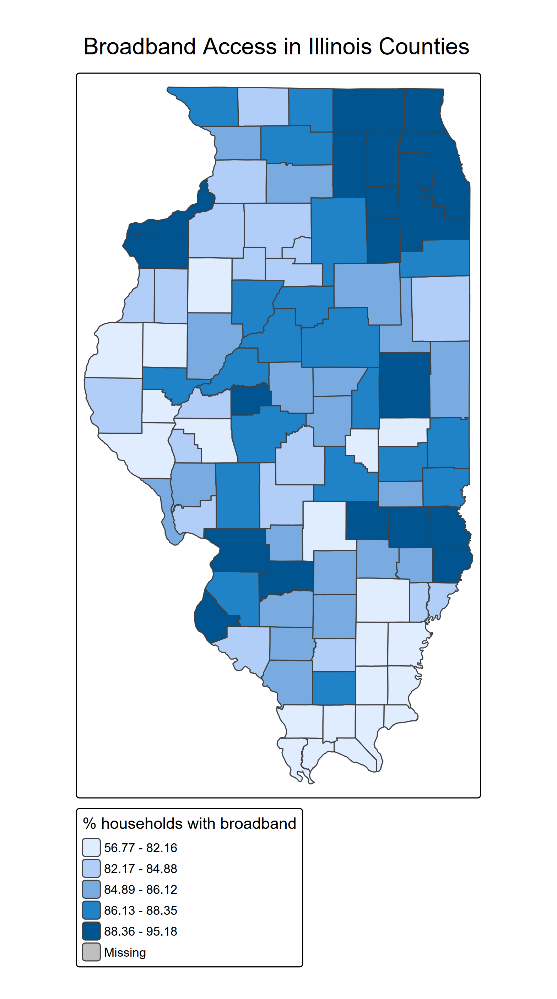
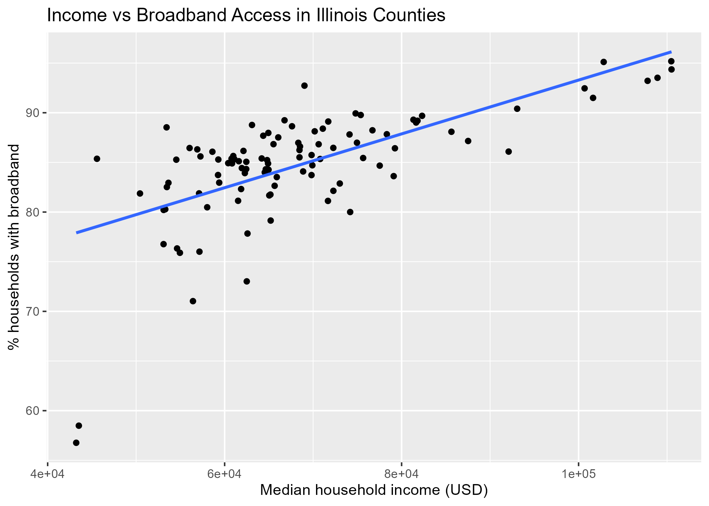
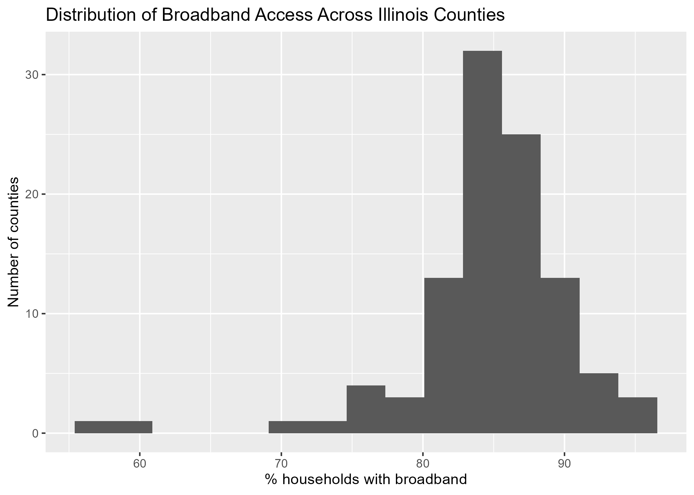

```{r setup, include=FALSE}
knitr::opts_chunk$set(echo = TRUE, warning = FALSE, message = FALSE)

library(tidyverse)
library(sf)
library(tmap)
library(plotly)
library(tidymodels)
library(rpart)
library(rpart.plot)
library(knitr)
library(DT)

il_geo <- readRDS("../data/processed/il_broadband_geo.rds")
il_df  <- read_csv("../data/processed/il_broadband.csv", show_col_types = FALSE)
```

# 1. Background and Research Questions

Reliable home internet has become a basic part of daily life. People need broadband connections to apply for jobs, complete schoolwork, use government services, and stay connected to family and community. When some places have much weaker internet access than others, it can deepen existing inequalities and limit opportunities for the people who live there.

In this project, I look at **broadband access across counties in Illinois**. Using data from the American Community Survey (ACS), I examine how many households in each county report having broadband internet, how that access relates to income, and whether simple machine-learning tools can flag counties that are likely to have relatively low broadband access.

I focus on three main questions:

1. How does broadband access vary across Illinois counties?  
2. How strongly is broadband access related to median household income at the county level?  
3. Can a decision tree classify which counties have relatively low broadband access based on income?

# 2. Data and Methods

## 2.1 Data source

The data come from the **American Community Survey (ACS) 5-year estimates**, accessed through the Census API in a separate script. For each county in Illinois, I use:

- Median household income  
- Total number of households in the internet table  
- Number of households with broadband of any type  

From these fields, I calculate the **percentage of households with broadband** in each county.

The original data, including geographic shapes for mapping, were saved in a raw file. A second script cleans the data, constructs the key variables, and saves two processed datasets:

- A spatial dataset with county boundaries  
- A non-spatial table with one row per county and the variables used in this report  

This R Markdown file reads the processed data and uses them for all of the analysis below.

## 2.2 Key variables

```{r variables-summary}
il_df %>%
  select(county, med_income, hh_total, hh_broadband_any, pct_broadband_any) %>%
  slice_head(n = 10)
```

The main variables are:

- `county`: county name  
- `med_income`: median household income in dollars  
- `hh_total`: total number of households in the internet table  
- `hh_broadband_any`: households with broadband of any type  
- `pct_broadband_any`: percentage of households with broadband (`100 * hh_broadband_any / hh_total`)

## 2.3 Basic descriptive statistics

```{r descriptives}
summary_stats <- il_df %>%
  summarise(
    n_counties           = n(),
    median_income_median = median(med_income, na.rm = TRUE),
    median_income_min    = min(med_income, na.rm = TRUE),
    median_income_max    = max(med_income, na.rm = TRUE),
    pct_bb_median        = median(pct_broadband_any, na.rm = TRUE),
    pct_bb_min           = min(pct_broadband_any, na.rm = TRUE),
    pct_bb_max           = max(pct_broadband_any, na.rm = TRUE)
  )

summary_stats
```

These summaries show that Illinois has 102 counties in the dataset, with median household income ranging from about the mid-$40,000s to a little over $100,000. Broadband access is generally high, but it still ranges from the mid-50 percent range to the mid-90s.

# 3. Results

## 3.1 Broadband access by county (map)

```{r map-broadband-image, echo=FALSE, out.width="80%"}

```

The map shows the percentage of households with broadband by county. Darker shades represent higher broadband access. Counties in and around the Chicago metropolitan area stand out with especially high access, as do some counties in central Illinois. Several counties in the southern and western parts of the state appear lighter, indicating lower broadband access. Overall, the map suggests a pattern where more urban and suburban counties tend to have stronger broadband coverage than some rural areas.

## 3.2 Relationship between income and broadband access

### 3.2.1 Static scatterplot

```{r scatter-income-broadband-image, echo=FALSE, out.width="80%"}

```

The scatterplot compares median household income with the percentage of households that have broadband. Each point is a county. The upward sloping line in the plot makes it clear that higher-income counties tend to have higher broadband access. Counties with incomes above roughly $80,000 almost all have broadband access above 85 percent. At the same time, there is some variation among mid-income counties: a few counties with incomes in the $60,000–$70,000 range still have relatively strong broadband access, while a small number of lower-income counties have noticeably lower access.

### 3.2.2 Interactive county table

```{r interactive-table, warning=FALSE, message=FALSE}
il_df_table <- il_df %>%
  mutate(
    low_bb = if_else(
      pct_broadband_any < median(pct_broadband_any, na.rm = TRUE),
      "yes",
      "no"
    )
  ) %>%
  select(county, med_income, pct_broadband_any, low_bb)

datatable(
  il_df_table,
  options = list(pageLength = 10, autoWidth = TRUE),
  rownames = FALSE
)
```

The interactive table above lists each county with its median income, broadband percentage, and a simple flag for whether it falls below the statewide median level of broadband access (`low_bb = "yes"`). The table can be sorted by income or broadband percentage and searched by county name. This provides a way to look up specific places and see how they compare to the rest of the state.

## 3.3 Distribution of broadband access across counties

```{r hist-broadband-image, echo=FALSE, out.width="80%"}

```

The histogram shows how county-level broadband access is distributed across Illinois. Most counties cluster between about 82 and 90 percent, with a peak in the mid-80s. A smaller group of counties reaches into the low 90s, and a handful fall well below the main cluster, in the 55–70 percent range. This pattern suggests that while broadband access is generally high, a small set of counties is clearly lagging behind the rest.

## 3.4 Advanced analysis: decision tree classification

For the advanced analysis, I use a **decision tree classifier** to see whether counties can be classified as having relatively low broadband access based on median household income. I define a county as “low broadband” (`low_bb = "yes"`) if its broadband percentage is below the median across all counties in the dataset.

```{r decision-tree-metrics}
median_pct <- median(il_df$pct_broadband_any, na.rm = TRUE)

il_ml <- il_df %>%
  mutate(
    low_bb = if_else(pct_broadband_any < median_pct, "yes", "no"),
    low_bb = factor(low_bb, levels = c("no", "yes"))
  ) %>%
  select(county, med_income, pct_broadband_any, low_bb) %>%
  drop_na()

set.seed(123)
split_obj <- initial_split(il_ml, prop = 0.8, strata = low_bb)
train_data <- training(split_obj)
test_data  <- testing(split_obj)

tree_spec <- decision_tree(
  tree_depth      = 4,
  cost_complexity = 0
) %>%
  set_engine("rpart") %>%
  set_mode("classification")

tree_fit <- workflow() %>%
  add_model(tree_spec) %>%
  add_formula(low_bb ~ med_income) %>%
  fit(data = train_data)

tree_preds <- predict(tree_fit, test_data, type = "class") %>%
  bind_cols(test_data)

metrics(tree_preds, truth = low_bb, estimate = .pred_class)
```

The metrics table reports how accurately the tree classifies counties in the held-out test set as low- or not-low broadband based only on median income. The performance is not perfect, but it is better than random guessing, which suggests that income alone carries real information about broadband access.

### 3.4.1 Decision tree visualization

```{r decision-tree-plot, fig.width=8, fig.height=5}
simple_tree <- tree_fit %>%
  extract_fit_parsnip() %>%
  pluck("fit")

rpart.plot(
  simple_tree,
  type          = 3,
  extra         = 104,
  fallen.leaves = TRUE,
  main          = "Decision Tree: Counties with Low Broadband Access"
)
```

The fitted tree turns out to be very simple. It uses a single split on median household income at about $66,000. Counties with median income **below** this threshold are mostly classified as “low broadband,” while counties **above** this threshold are mostly classified as “not low broadband.” Looking at the node statistics, roughly three-quarters of the counties below $66,000 are predicted to be low broadband, while about one-fifth of the higher-income counties fall into the low-broadband group. The tree therefore summarizes the earlier scatterplot in a straightforward rule: counties with incomes under about $66,000 are much more likely to be struggling with broadband access.

# 4. Interpretation and Policy Implications

Across all of these visuals, a consistent picture emerges. Broadband access in Illinois is generally high, but the map and histogram show that a small group of counties clearly trails the rest of the state. The scatterplot and decision tree both point to income as an important predictor: higher-income counties are much more likely to have strong broadband coverage, while counties with median incomes under about $66,000 are disproportionately likely to fall into the low-broadband group.

From a policy perspective, this suggests that efforts to close the digital divide should pay special attention to lower-income counties, especially in parts of the state that already face other disadvantages. Targeted investments could include support for broadband infrastructure, subsidies or vouchers for low-income households, or partnerships with local organizations to expand affordable broadband options. For higher-income counties that still show gaps, the problem may be less about infrastructure and more about affordability or awareness, which would require a different set of interventions.

# 5. Ethics, Fairness, and Limitations

Several limitations and fairness concerns are important to keep in mind.

First, the ACS measures whether households report having broadband, but it does not capture speed, reliability, or data caps. A household might technically have broadband service but still struggle to use it for streaming classes or remote work. Second, the ACS is a survey and has margins of error, especially for smaller counties. Treating these estimates as exact can hide real uncertainty.

Third, this analysis is done at the county level. Counties with high overall broadband access may still contain neighborhoods or groups that are poorly served. Looking only at county averages risks overlooking those local gaps. Fourth, labeling some counties as “low broadband” can unintentionally stigmatize places. The intent here is not to blame communities, but to identify where additional support and resources might be most needed.

Finally, this report only uses income and broadband access. Factors like race, age, disability status, or local policy decisions are not included, but they likely shape digital inequality in important ways. A more complete analysis would bring in some of those dimensions and would also involve local residents in interpreting the results.

# 6. Conclusion and Next Steps

This project uses ACS data to explore the digital divide across Illinois counties. The main findings are:

- Broadband access is high in many counties, but a small set of counties clearly lags behind.  
- Broadband access is positively associated with median household income; lower-income counties are more likely to have weaker broadband coverage.  
- A simple decision tree based on income alone can separate counties into higher- and lower-risk groups, with a key split around $66,000 in median household income.

These patterns point toward the need for targeted policy responses. State agencies, local governments, and community organizations could use similar analyses to identify counties where investments in broadband infrastructure and affordability would have the greatest impact. At the same time, more detailed work is needed to understand conditions within counties and to make sure that improvements actually reach residents who are currently left out.

Future extensions of this work could incorporate additional variables (such as educational attainment, urban/rural status, or race and ethnicity), use more granular geographic units, or combine quantitative analysis with interviews or surveys of local stakeholders. Together, those steps would help build a fuller picture of digital inequality and support more effective, equitable efforts to close the broadband gap in Illinois.
